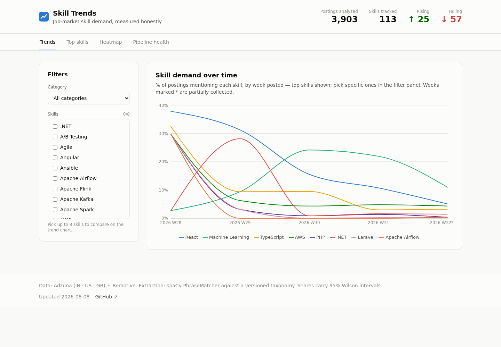
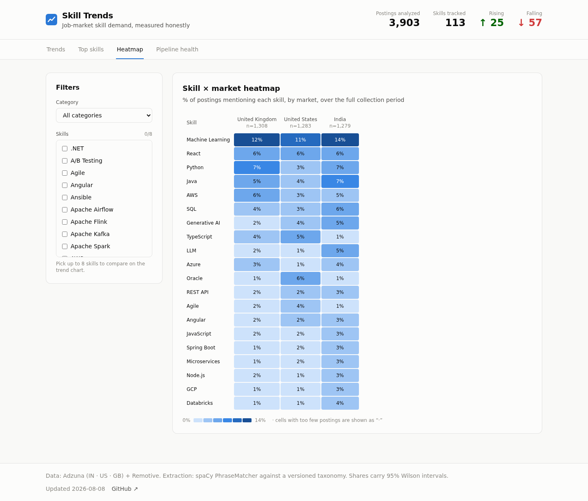

# Skill Trends

**Live dashboard:** https://same-as-usual.github.io/Visualization-project/

An end-to-end data pipeline and dashboard that tracks which skills employers ask
for across the **India, US, UK and remote** job markets — collected daily from
legitimate APIs, extracted with NLP, and reported with honest statistics.



## Features

- **Automated daily collection** — GitHub Actions pulls job postings from the
  Adzuna and Remotive APIs every day and commits them to an append-only raw zone
- **NLP skill extraction** — spaCy PhraseMatcher against a versioned ~120-skill
  taxonomy, with per-skill match policies that separate *"advanced Excel"* from
  *"excel in this role"* and *"written in Go"* from *"go to our website"*
- **Honest statistics, by design**
  - Shares are **% of all postings**, never raw counts (posting volume fluctuates)
  - Every share carries a **95% Wilson confidence interval**
  - Groups with fewer than 30 postings are **suppressed**, not reported as noise
  - Week-over-week deltas only compare **complete weeks** — a half-collected week
    is flagged `*` on the chart instead of masquerading as a market crash
- **Skill × market heatmap** — demand compared across India, the US and the UK
- **Warehouse layer** — Postgres (Neon) loader with `(source, source_id)`
  deduplication plus dbt staging and mart models, schema-tested in CI
- **Zero-backend deployment** — the pipeline exports static JSON; the React
  dashboard is rebuilt and republished to GitHub Pages after every collection run



## How it works

```
        02:30 UTC daily                03:15 UTC daily
┌──────────────────────────┐   ┌─────────────────────────────┐
│  collect (GitHub Action) │   │  publish (GitHub Action)    │
│                          │   │                             │
│  Adzuna API (in/us/gb)   │   │  extraction (spaCy)         │
│  Remotive API (remote)   │──▶│  aggregation (Wilson CIs)   │
│  → validate (Pydantic)   │   │  static JSON export         │
│  → append-only raw JSONL │   │  → React build              │
│  → commit to repo        │   │  → deploy to GitHub Pages   │
└──────────────────────────┘   └─────────────────────────────┘
                │
                ▼
      ┌──────────────────────┐
      │  load (GitHub Action)│
      │  Postgres (Neon)     │
      │  + dbt staging/marts │
      └──────────────────────┘
```

1. **Collect** — `ingestion/` hits the Adzuna (`in`, `us`, `gb`) and Remotive
   APIs on a daily cron. Responses are validated at the boundary, malformed
   records are quarantined (never dropped silently), and everything lands as
   append-only JSONL with run metadata for observability.
2. **Extract** — `nlp/` matches each posting's text against the taxonomy.
   Every mention records its alias, character span, and taxonomy version, so
   extraction is reproducible. A postings index (every posting, matched or not)
   provides true denominators for the share math.
3. **Aggregate** — `aggregation/` buckets postings by the week they were
   *posted* (not fetched), computes shares with Wilson CIs, 4-week rolling
   deltas, and rising/falling/stable direction flags.
4. **Publish** — `scripts/export.py` writes dashboard-ready JSON; the React +
   Recharts dashboard is built and deployed to GitHub Pages. No live backend,
   nothing to cold-start.

## Quick start

```bash
# Python pipeline
python -m venv .venv && .venv/bin/pip install -e ".[dev]"
export ADZUNA_APP_ID=...   # free keys: https://developer.adzuna.com
export ADZUNA_APP_KEY=...

.venv/bin/python -m ingestion.run collect --backfill      # day 0: ~30 days of history
.venv/bin/python -m nlp.run --input data/raw/ --output data/extracted/
.venv/bin/python scripts/export.py --input data/extracted/ --raw data/raw/ \
    --output dashboard/public/data/

# Dashboard
cd dashboard && npm install && npm run dev
```

Run the tests:

```bash
.venv/bin/python -m pytest        # 50 tests: collectors, extraction, aggregation
```

### CI setup (fork/reuse)

| Workflow | Schedule | Needs |
|---|---|---|
| `collect` | daily 02:30 UTC | repo secrets `ADZUNA_APP_ID`, `ADZUNA_APP_KEY` |
| `load` | daily 02:45 UTC | repo secret `DATABASE_URL` (Neon free tier) |
| `publish` | daily 03:15 UTC | Pages enabled (Settings → Pages → GitHub Actions) |

The Adzuna call budget is enforced in code: the config loader computes
`roles × countries × pages × 31 days` and refuses to start if the projection
exceeds 900 calls/month (free tier: 1,000). Default: 6 roles × 3 countries ×
1 page ≈ 558 calls/month. Roles are configurable in `config/pipeline.yaml`
(any six or fewer).

## Project structure

```
├── config/pipeline.yaml     # collection config: roles, countries, budget
├── ingestion/               # API collectors, validation, landing zone
├── nlp/                     # skill extractor + versioned taxonomy
├── aggregation/             # shares, Wilson CIs, deltas, direction flags
├── warehouse/               # Postgres loader + dbt models
├── scripts/export.py        # static JSON export for the dashboard
├── dashboard/               # React + Recharts + Tailwind frontend
├── tests/                   # 50 tests incl. gold-set precision gate
└── docs/adr/                # architecture decision records
```

## Design decisions

- **APIs, not scraping** ([ADR-0001](docs/adr/0001-data-sources.md)) — LinkedIn
  and Naukri actively block and litigate against scrapers; a pipeline built on
  them dies mid-project. Adzuna and Remotive are legal, stable, and free.
- **GitHub Actions, not Airflow** ([ADR-0002](docs/adr/0002-scheduling.md)) —
  one daily DAG of three steps doesn't need an orchestrator to babysit.
- **Git as the raw zone** ([ADR-0003](docs/adr/0003-raw-zone.md)) — append-only
  JSONL committed to the repo gives free history, diffs, and reproducibility at
  this data volume.
- **Truncation measured, not ignored** — Adzuna descriptions are excerpts.
  Remotive provides full text, which lets the pipeline quantify the recall gap
  instead of silently under-counting late-posting skills.

## Known limitations

- **Short history** — trend lines start from a ~30-day API backfill and grow
  daily. Weeks with partial coverage are flagged, and direction calls require
  4 weeks of history; early "trends" are reported as insufficient data rather
  than oversold.
- **Source mix shifts** — Remotive is remote/dev-heavy, Adzuna is broader;
  early weeks with fewer Adzuna postings skew toward web-dev skills. More
  collection days dilute this.
- **Excerpt recall** — skills mentioned late in a posting can be missing from
  Adzuna's truncated descriptions; the Remotive full-text comparison bounds
  the effect.

## Tech stack

Python 3.11 · Pydantic · spaCy · PostgreSQL (Neon) · dbt · React · Vite ·
Recharts · Tailwind CSS · GitHub Actions · GitHub Pages
